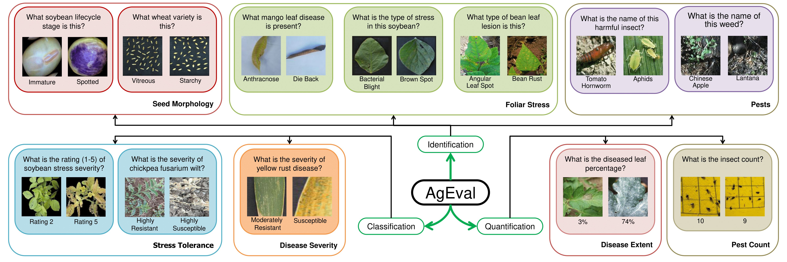

# AgEval Benchmark

This repository contains the companion code for the AgEval benchmark datasets, focusing on plant stress identification, classification, and quantification. It includes 12 subsets of data used in the benchmark.



## Few-Shot Learning Approaches

We implement and evaluate the following approaches:

1. **Zero-Shot Learning**
   - Implemented as Random Few-Shot with 0 examples
   - Direct prediction based on the input image alone
   - Serves as the baseline for all methods

2. **Random Few-Shot Learning with Hierarchical Prediction**
   - Traditional few-shot approach with random example selection
   - Examples selected randomly from entire dataset without hierarchical constraints
   - Despite non-hierarchical examples, predictions are made at each taxonomic level
   - Predicts kingdom → phylum → class → order → family → genus → species
   - Important baseline to compare with hierarchical-aware selection

3. **Hierarchical Assisted Few-Shot Learning (Our Method)**
   - Combines hierarchical classification with intelligent example selection
   - Uses visual similarity to select relevant examples
   - Examples respect both visual similarity AND current taxonomic level
   - Follows biological taxonomy (kingdom → phylum → class → order → family → genus → species)
   - Each level's examples are filtered based on previous level's prediction

## Key Implementation Details

### Random Few-Shot Implementation
- Number of shots = 0 implements zero-shot learning
- Examples are selected randomly from entire dataset
- No hierarchical constraints in example selection
- Still performs hierarchical prediction at each level
- Useful to evaluate hierarchical prediction without hierarchical example selection

### Hierarchical Assisted Implementation
- Examples selected based on visual similarity
- Example selection respects current taxonomic level
- Previous level predictions constrain next level's search space
- Combines benefits of similarity and hierarchy

## Overview

The main components of this repository are:

1. `inference.py`: Script for evaluating models on the AgEval Benchmark datasets
2. `data_loader.py`: Functions for downloading and preparing the benchmark datasets
3. `get_embedding.py`: Functions for computing visual embeddings using Vision Transformer

The benchmark includes several dataset variants:
- BioTrove-Balanced: A balanced subset with 10 samples per species (300 species)
- BioTrove-Train: The full training dataset
- BioTrove-Test: Held-out test set
- BioTrove-Benchmark: Collection of evaluation benchmarks

To replicate the results presented in the paper, run `inference.py` to evaluate the different few-shot learning approaches on the datasets.

## Inference (`inference.py`)

The `inference.py` script contains:

- Implementation of multiple AI models (OpenAI, Anthropic, Google, OpenRouter)
- Functions for asynchronous processing to improve performance
- Progress tracking using tqdm
- Result saving in CSV format
- Implementation of all three few-shot learning approaches
- Customizable number of shots (1-8) for evaluation
- Hierarchical prediction with similarity-based example selection

### Supported Models

1. GPT-4 (OpenAI)
2. Claude-3.5-sonnet (Anthropic)
3. Claude-3-haiku (Anthropic)
4. LLaVA v1.6 34B (OpenRouter)
5. Gemini-flash-1.5 (Google)
6. Gemini-pro-1.5 (Google)

### Default Model
7. The default model for all evaluations is gpt-4o-mini (OpenAI). This identifier must not be changed as it represents a newer model version. 


## Visual Similarity

The repository uses Vision Transformer (ViT) for computing visual embeddings to find similar examples. This is crucial for:
- Selecting relevant examples in hierarchical assisted few-shot learning
- Ensuring examples are visually similar to the input image
- Improving prediction accuracy at each taxonomic level

## Data Loader (`data_loader.py`)

The `data_loader.py` script provides functions to download and prepare the 12 AgEval benchmark datasets. Features include:

- Dataset-specific loading functions
- Automatic downloading from Kaggle or Zenodo if not present
- Extraction and renaming of files in the `/data` folder
- Random sampling with a fixed seed for reproducibility

### Available Datasets

1. Durum Wheat Dataset
2. Soybean Seeds Dataset
3. Mango Leaf Disease Dataset
4. DeepWeeds Dataset
5. Bean Leaf Lesions Dataset
6. Yellow Rust 19 Dataset
7. FUSARIUM 22 Dataset
8. PlantDoc (Leaf Disease Segmentation)
9. Dangerous Insects Dataset
10. IDC (Iron Deficiency Chlorosis) Dataset
11. Soybean Diseases Dataset (PNAS)
12. InsectCount Dataset

### Usage

Each dataset loading function accepts a `total_samples_to_check` parameter (default is 100) to specify the number of samples per class for evaluation:

```python
from data_loader import load_and_prepare_data_DurumWheat

samples, classes, dataset_name = load_and_prepare_data_DurumWheat(total_samples_to_check=50)
```

## Notes

- The scripts will skip downloading datasets if they already exist in the `/data` folder.
- Evaluation results are saved in the `/results` folder, organized by model name and dataset.
- For detailed information on each dataset and the evaluation process, please refer to the AgEval benchmark paper.

For more detailed information about the implementation, please refer to the comments in the source code files.
